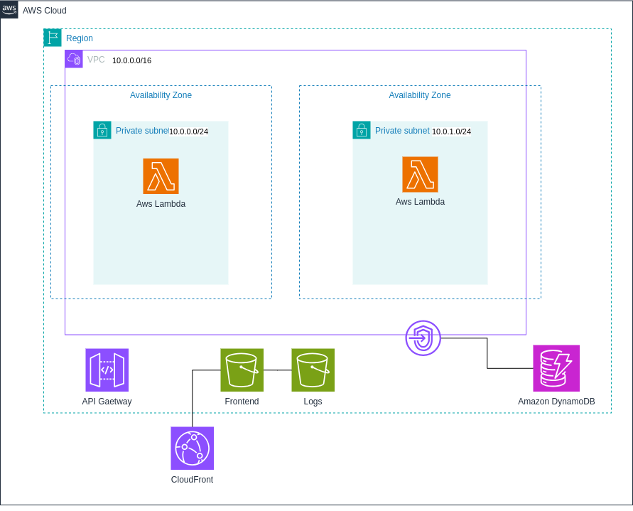

Cloud Computing: Trabajo Práctico 3
===================================
## Grupo 4

### Módulos:
- `lambdas`: crea las lambdas dadas ciertas variables (nombre, handler, runtime, filename, role y environment variables) en subnets pasadas como parámetro. Requiere que existan los archivos de código. Como output devuelve las lambdas creadas.
- `api-gateway-lambdas`: crea un API Gateway HTTP que apunta a las lambdas pasadas como parámetro. Crea un deployment stage "dev". Requiere que existan las lambdas. Como output devuelve la URL de invocación de la API Gateway.
- `vpc`: módulo externo que crea una VPC con disitntas subnets. Se optaron subnets privadas. Requiere que se le pase un nombre y un CIDR block. Link: https://registry.terraform.io/modules/terraform-aws-modules/vpc/aws/latest

### Funciones:
- `slice`: se usa para elegir las primeras 2 Availability Zones de una región.
- `fileset`: se usa para elegir que archivos subir a S3.
- `jsonencode`: se usa para codificar en JSON la bucket policy.
- `filebase64sha256`: se usa para detectar cambios en el código fuente de las funciones lambda.
- `filemd5`: se usa para el etag de los archivos subidos a S3.
- `lookup`: se usa para buscar que content type es un archivo para subirlo a S3.
- `lower`: se usa para almacenar en el mapa de lookup sólo en minúsculas.
- `split`: se usa para separar el content type en el lookup.
- `element`: se usa para elegir el último elemento (content type) del nombre de un archivo.
- `length`: se usa para saber a que índice se encuentra el último elemento (content tyope) de el nombre de un archivo.

### Meta-argumentos:
- `depends_on`: se usa para que un recurso espere a que otro recurso se haya creado antes de crearse.
- `for_each`: se usa para crear múltiples recursos de un mismo tipo.
- `lifecycle`: se usa para crear antes de destruir los recursos para mantener la disponibilidad.

### Diagrama de arquitectura:

### Participación
| Nombre | Participación |
| ------ | ------------- |
| Paz Aramburu | 20% |
| Franco De Simone | 20% |
| Manuel Dizenhaus | 20% |
| Agustin Gutierrez | 20% |
| Luciano Neimark | 20% |
